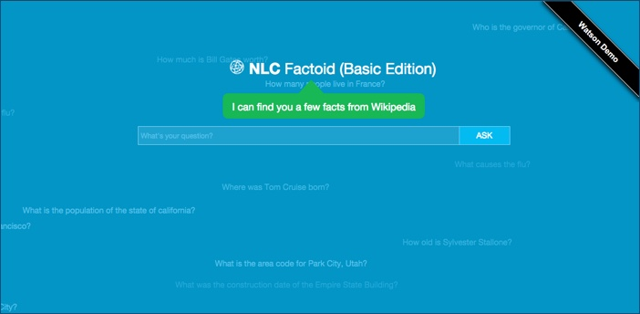

# NLC+DBpedia Factoid (Basic Edition)
Check out the [demo running on Bluemix](http://nlc-factoid-assistant.mybluemix.net/) to experience what you can build.

This demo combines Watson's [Natural Language Classifier](https://www.ibm.com/smarterplanet/us/en/ibmwatson/developercloud/nl-classifier.html), entity and concept extraction from [AlchemyLanguage](https://www.ibm.com/smarterplanet/us/en/ibmwatson/developercloud/alchemy-language.html), and SPARQL queries into [DBpedia (Wikipedia's RDF database)](http://www.dbpedia.org).

### Getting Started
Let's start with a few types of standard factoid questions and determine how we might answer them:
 `What is the capital of *?` 
`Who is *'s spouse?` 
`When was * born?` 
`What is the birthplace of *?` 
`What's the population of *?` 
`.....` 

The full set of supported question types can be found in [data/nlc_factoid_training.csv](https://github.com/biosopher/nlc-factoid-assistant/blob/master/data/nlc_factoid_training.csv).  They are grouped into these category types:
 `health-condition_cause` 
`person-birthdate`          `person-birthplace`          `person-children`          `person-net_worth` 
`person-schooling`                    `person-spouse`          
`place-areacode`          `place-capital`          `place-completion_date`          `place-governor_mayor` 
`place-height`          `place-population` 
#### More Details
For more details about developing applications that use Watson Developer Cloud services in Bluemix, see [Getting started with Watson Developer Cloud and Bluemix](http://www.ibm.com/smarterplanet/us/en/ibmwatson/developercloud/doc/getting_started/).

#### License
This sample code is licensed under Apache 2.0. Full license text is available in [LICENSE](https://github.com/watson-developer-cloud/natural-language-classifier-nodejs/blob/master/LICENSE).
This sample uses [jquery](https://jquery.com/) which is MIT license.

#### Disclaimer
The techniques and code shared are my own and don't necessarily represent IBM's position, strategies or opinions. Anyone is free to use, copy, distribute, modify or sell the source code and other materials shown in this video and it is provided "as is" without warranties. I am not responsible for any harm or damage caused to your computer, software or anything else caused by this material.
